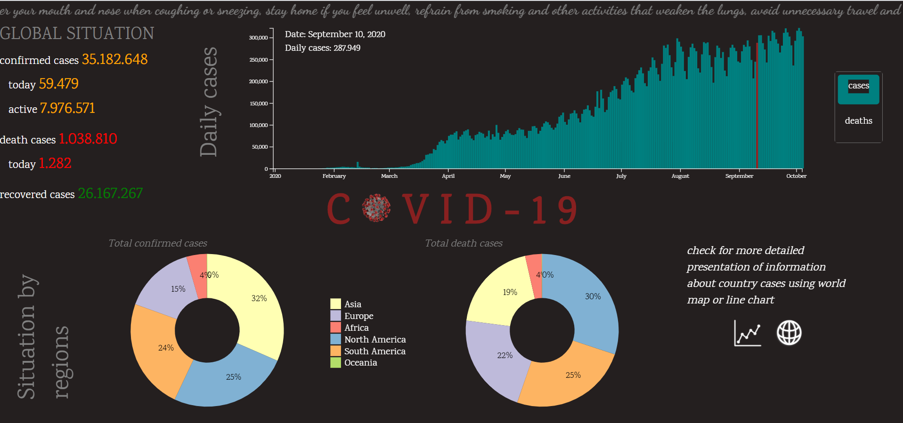
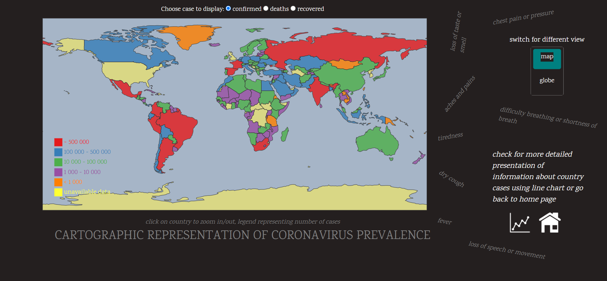
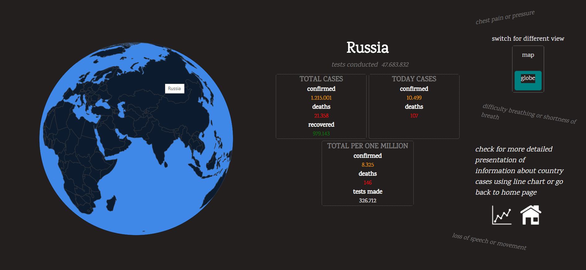
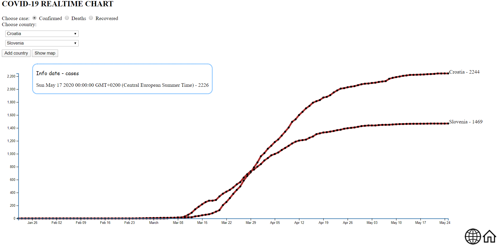

**COVID-19 visualization with D3.js**   
REST API's datasets used: 
"https://covid.ourworldindata.org/data/owid-covid-data.json" 
"https://coronavirus-19-api.herokuapp.com/countries"   
**Project features**   
Home page 

- animated text transition of prevention hints
- global world situation (confirmed, death and recovered cases)
- animated bar chart of world's daily cases and deaths (toggle switch)
- pie chart global cases divided according to regions
   

World map page 

- Covid-19 prevalence on 2D and 3D world projection (toggle switch)
- cases on world map projection (including legend, zooming in/out)
- animated globe projection(displaying case numbers of the indicated country, including zooming and rotating globe)
  
   

Line chart page 

- detailed overview of the number of cases per day between specific states
  
